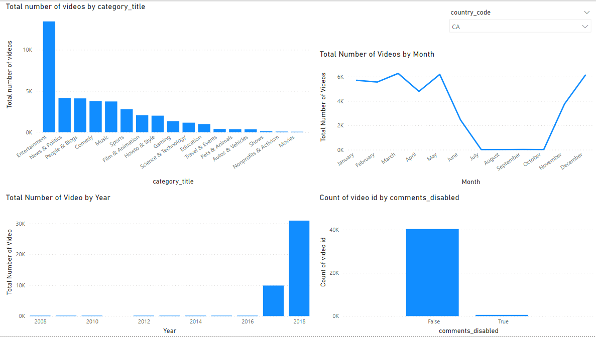
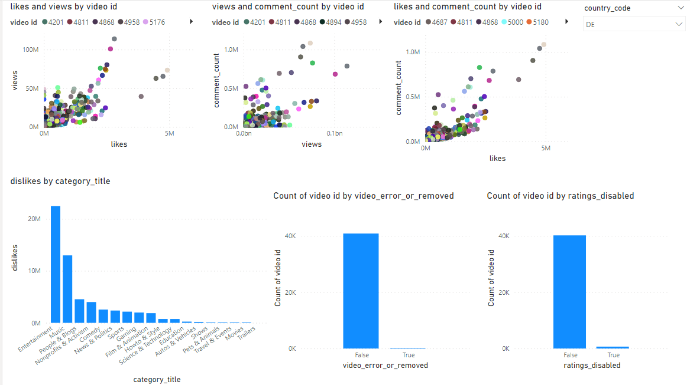
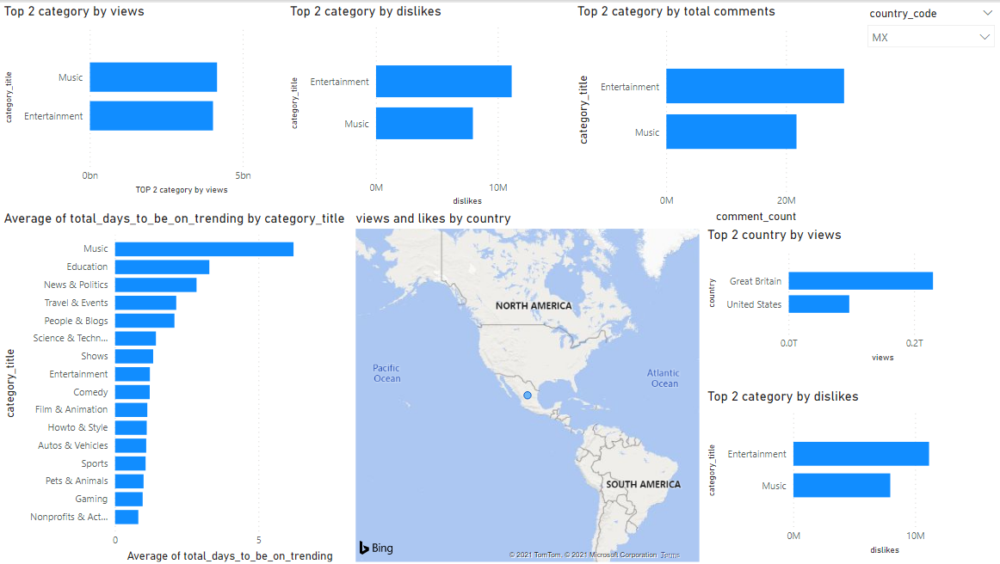
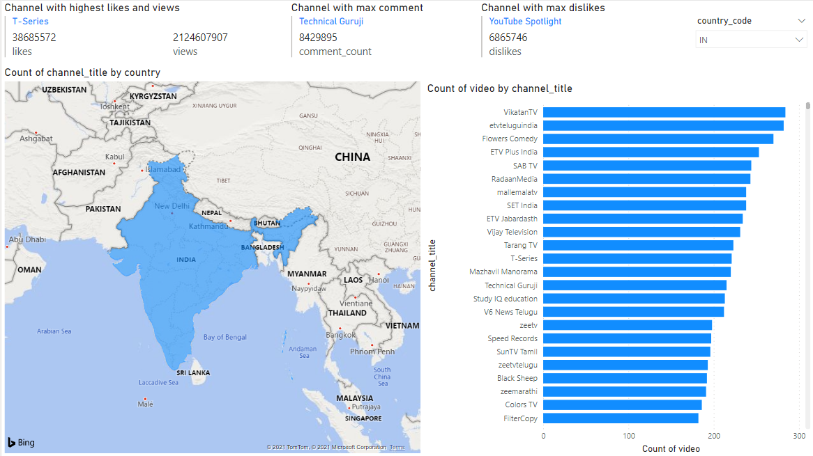

# Data Visualization

POWER BI was used for data visualization. 
The BI tool can be used directly to connect with postgresql database and retrieve required database tables.
After providing correct username and password, one can connect with the database.
I have created a calculated field called total_days_to_be_on_trending in POWER BI which subtracts the trending date from publish date to provide the difference between these two dates.

The visiualizations I have made in Power BI are as folllows:

* YouTube Video Dashboard 1

There is a slicer to filter the data accoriding to country with the help of country_code.
The `Total number of videos by category_title` bar graph shows the total number of videos which went on trending as per the category_title of the video. It can be clearly seen that entertainmnet is the category with maximum videos. Similarly, the second line chart shows total trending videos published month wise. Likewsie, the third bar graph shows total trending videos published according to a year. Lastly, the last graph shows the total videos which had comments disabled or not.

* YouTube Video Dashboard 2

This dashboard also has a slicer to filter the visualization according to the country code.
The first three scatterplot shows the relationship between views and likes, views and comment, likes and comment. It can be seen that there is proportional relationship betweenthem excluding some outliers. Similarly, the dislikes bar graph shows that the highest number of dislikes is at entertainment category. Likewise, it can be seen that only some trending vodeps have ratings disabled and video error or removed.

* YouTube Video Dashboard 3

This dashboard also has a slicer to filter the visualization according to the country code. The first three bar graph shows top 2 category having highest likes, dislikes, and comments. It can be seen that only entertainment and music lies in top 2. Similarly, there's a bar graph which shows on average how many days it take a video from certain category to be on trending. Also, there's a map to look total views and likes for a country. Finally, there are 2 KPIs which show top 2 country and top 2 category according to total views and dislikes respectively.

* YouTube Video Dashboard 4

This dashboard also has a slicer to filter the visualization according to the country code. This dashoard is relatd to channel title only. The first three KPI shows the channel having highest likes and views, coments and dislikes respectively. The map shows how many channels are ina country which provided trending content and similarly, the bar graph shows how many trending videos ha a channel published.