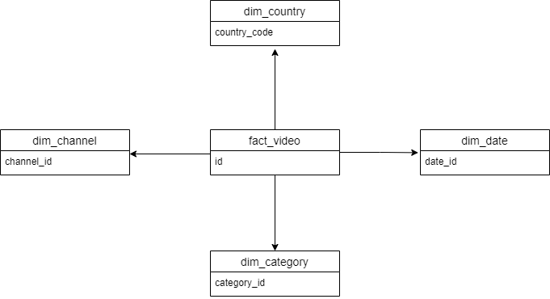
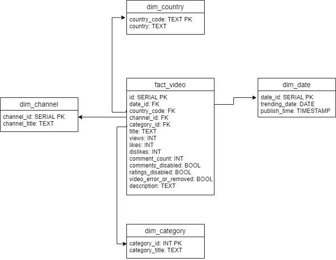

# Data Warehouse Design For YouTube Video Statistics
## Business Requirements

The following are the business requirements of the system:
* The business domain is social media
* Analyze category data to find out most published catgeory vidoes
* Analyze video data to find out more about the relationship between
   - likes and views
   - views and comment_count
   - likes and comment_count
* Identify whether trending videos have comments disabled or videoerror or removed

## Potential Area of Analysis
The following are the potential area of analysis:
* Identify total video published month wise as per country
* Identify total video published in a year country wise
* Identify the total trending videos having commentsdiabled or ratings disabled
* Identify the total video published category wise
* Is views increasing with increase in likes?
* Is comment_count increasing with increase of likes?
* Is comment_count increasing with increase of views?

## Possible Facts and Dimensions
The following are the possible facts and dimensions:
- **dim_country** (*country_code*, country)
- **dim_channel** (*channel_id*, channel_title)
- **dim_category** (*category_id*, category_title)
- **dim_date** (*date_id*, trending_date, publish_time)
- **fact_video** (*id*, video_id, date_id, country_code, channel_id, category_id, title, views, likes, dislikes, comment_count, commens_disabled, ratings_disabled, video_error_or_removed, description )

# Conceptual Model

## Identifying Attributes and Relationships between the Fact and Dimension Tables
### dim_country
Attributes | Description | Domain
---------- | ----------- | ------
country_code | The identifier for dim_country. | TEXT, PK
country | The name of the country. | TEXT

### dim_channel
Attributes | Description | Domain
---------- | ----------- | ------
channel_id | The identifier for dim_channel. | SERIAL, PK
channel_title | The name of the channel. | TEXT

### dim_category
Attributes | Description | Domain
---------- | ----------- | ------
category_id | The identifier for dim_category. | INT, PK
category_title | The name of the ctegory. | TEXT

### dim_date
Attributes | Description | Domain
---------- | ----------- | ------
date_id | The identifier for dim_date. | SERIAL, PK
trending_date | The date when the video was on trending. | DATE
publish_time | The date and time when the video was published. | TIMESTAMP

### fact_video
Attributes | Description | Domain
---------- | ----------- | ------
id | The identifier for fact_video. | SERIAL, PK
date_id | The id of the date. | INT, FK
category_id | The id of the category. | INT, FK
country_code | The id of the country. | TEXT, FK
channel_id | The id of the channel. | INT, FK
title | The title of the video. | TEXT
views | The total views of the video. | INT
likes | The total likes of the video. | INT
dislikes | The total dislikes of the video. | INT
comment_count | The total comments of the video. | INT
commens_disabled | The comments are disabled or not. | BOOL 
ratings_disabled | The ratings are disabled or not. | BOOL
video_error_or_removed | The video has error or removed or not. | BOOL
description | The description of the video. | TEXT

# Physical Model
