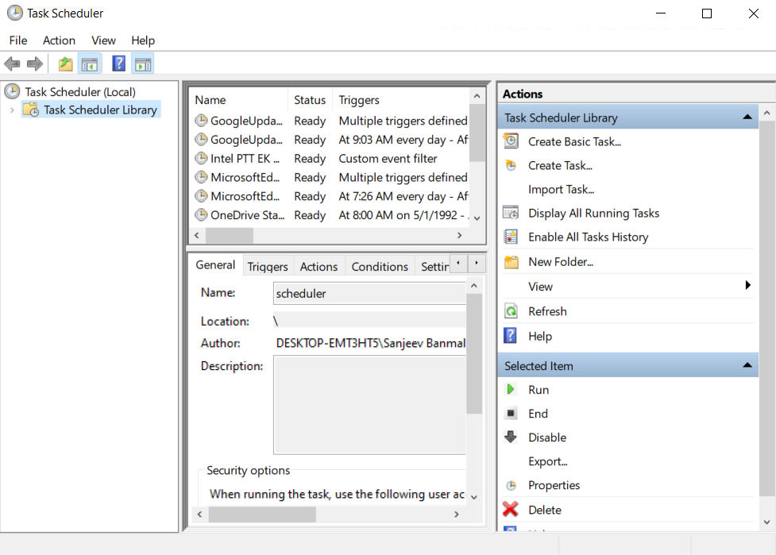

# Folder Structure

The folder structure of this project is given below:
* data - contains data files to be extracted
* docs - contains documentation file for datawarehouse deisgn and ETL pipeline
* schema - contains SQL create script for required tables and procedures
* src - contains three folders which are
    - pipeline - python scripts for pipeline
    - sql - data validation scripts and other scripts
    - utils - database connection scripts and other utilities


# ETL Process


## Extraction

The following are the steps involved in extraction:
- A database final_assignment is created.
- Two raw tables are created as raw_video, raw_category.
- The data types for all the attributes in all the tables are set as VARCHAR.
- Constraints are not defined for any of the tables.
- Bulk import is done with the use of COPY command for each data file at a time.

## Transformation
- The transfomed data are stored in transformation_video table.
- IN raw_video table,
  - Change video_id to first seven letters of video title having video id as '#NAME?'
  - Format the trending date in correct date format.
  - Also format the publish time in correct date format.
  - Change tags with [none] as NULL.
  - Change datatypes where necessary like views as INT etc.
- IN raw_category table,
  - Cast category_id as INT
- Check the data vaidation for the transformed data
- Save to archive incrementally if the data validation passes.

## Loading
- Loading will only occur if the data validation are passed
- Empty the fact_video table
- Empty all the dimension table
- Insert into dim_country table selecting distinct country_code
- Insert into dim_date selecting distinct publish_time and trending_date
- Insert into dim_category selecting distinct category from category archive
- INsert into dim_channel selecting distinct channel title
- Insert into fact_video selecting all the keys from dimension tables and facts


# How the ETL pipeline actually works?

## Database Connection

First of all, a connection with the database must be established.

For this, there is a file named `database_connection.py` inside `src/utils` folder.

Initially, required libraries like psycopg2 is imported which acts as a driver to connect with postgres database in python.
Then, all the credentials like host, database name, user, password and port are passed through .env file.

```
# importing required libraries
import psycopg2
import os
from dotenv import load_dotenv
```

```
# loading all the varibles stored in .env
load_dotenv() 

# using try to handle exception
try:
    # defining function connect() which returns connection object with database
    # all credentials are passed through .env variables 
    def connect():
        return psycopg2.connect(
            
            host = os.getenv('HOST'),
            user = os.getenv('USER'),
            password = os.getenv('PASSWORD'),
            port = os.getenv('PORT'),
            database = os.getenv('DATABASE')
        )  

# throwing exception if there are any
except Exception as e:
    print('AN error has occured', e)
```

## Extraction and Transformation

The extraction and transformation is performed in `extract_from_file.py`

First of all, the required libraries are imported.

```
# importing required files and libraries
import json
from data_validation import *
```
### Extracting video data

At first this function, takes cur, con and filePath as parameter. It extracts filename from filePath. Then, it passes the filePath and filename parameter to procedure extract_video() and finally calls it using cur object.
```
def extract_video_from_raw(cur,con,filePath):
    fileName = "'"+filePath[25:27]+"'"
    call_procedure_extract_video="CALL extract_video('"+filePath+"',"+fileName+")"
    cur.execute(call_procedure_extract_video)
    con.commit()
```
Then, this function is used to transform the raw video data. Simply, this function also calls the procedure transform_video() which does all the tasks.
```
def transform_video_from_raw(cur,con):
    call_procedure_transfrom_video="CALL transform_video()"
    cur.execute(call_procedure_transfrom_video)
    con.commit()
```

This function does incremental extraction to the raw_video_archive table taking cur, con and filePath as parameters
```
def incremental_extract_to_archive(cur,con,filePath):
    fileName = "'"+filePath[25:27]+"'"
    incremental_update="""
    INSERT INTO raw_video_archive 
    SELECT * 
    FROM transform_video 
    WHERE video_id 
    NOT IN( SELECT video_id FROM raw_video_archive WHERE country_code = """+fileName+""")
    AND trending_date
    NOT IN( SELECT trending_date FROM raw_video_archive WHERE country_code = """+fileName+""")"""
    cur.execute(incremental_update)
    con.commit()
```
This function is used to execute all the above functions related to video extraction and transformation which are extract_video_from_raw, transform_video_from_raw and incremental_extract_to_archive
```
def main_extract_video(cur,con,filePath):
    
    extract_video_from_raw(cur,con,filePath)
    transform_video_from_raw(cur,con)
    # variable to store total failed test cases
    count_error=check_video_data_validity(cur,con)
    # incremental extraction only if there are 0 failed cases
    if(count_error==0):
        incremental_extract_to_archive(cur,con,filePath)
        print("Extraction successfull for "+filePath[25:])
    else:
        print
```
### Extracting category data

This function truncates all the data from table raw_category
```
def delete_data_from_raw_category(cur,con):
    truncate_query = "TRUNCATE TABLE raw_category;"
    cur.execute(truncate_query)
    con.commit()
```
This function extracts the data from json file
```
def extract_category_from_raw(cur,con,filePath):
    f = open(filePath, "r")
    data = json.load(f)
    for json_data in data['items']:
        id = json_data['id']
        title = json_data['snippet']['title']
        insert_query="INSERT INTO raw_category(category_id,category_title) VALUES ('"+id+"','"+title+"')"
        cur.execute(insert_query)
        con.commit()
```
This function is used to incrementally extract the data to archive table of category
```
def incremental_save_category_to_archive(cur,con):
    with open('../sql/incremental_update_category.sql') as file:
        incremental_update_category = " ".join(file.readlines())
        cur.execute(incremental_update_category)
        con.commit()
```
This function calls all the above function used to extract and transform category data which are delete_data_from_raw_category, extract_category_from_raw and incremental_save_category_to_archive
```
def main_extract_category(cur,con,filePath):
    delete_data_from_raw_category(cur,con)
    extract_category_from_raw(cur,con,filePath)
    # variable to store total failed test cases
    count_error=check_category_data_validity(cur,con)
    # incremental extraction only if there are 0 failed cases
    if(count_error==0):
        incremental_save_category_to_archive(cur,con)
        print("Extraction successfull for "+filePath[11:])
    else:
        print
```
### Data Validation

All the codes related to data validation can be found in `data_validation.py` file.
The file contains following code:

Importing required libraries
```
import os
```
Function to validate data of video_data which takes cur and con as parameter
```
def check_video_data_validity(cur,con):
    # variable to store the path where validation scripts are available for video data
    the_dir = 'E:\\Final_Assignment\\src\\\sql\\validation_scripts\\video_validation'
    # variable to store all .sql file validation scripts name using lamda function
    all_validation_files = filter(lambda x: x.endswith('.sql'), os.listdir(the_dir))
    # variable to count total number of failed test cases. Initially it is 0
    count=0
    # looping through each file in all_validation_files
    for each_script in all_validation_files:
        #opening each validation_scripts
        with open('../sql/validation_scripts/video_validation/'+each_script) as file:
            # joining all lines in script
            validation_script = " ".join(file.readlines())
            # excuting the validation script
            cur.execute(validation_script)
            #storing the fetched values in result
            result=cur.fetchone()
            # does nothing if there is 0 failed cases
            if(str(result)=="(0, 'passed')"):
                print
            else:
                # adds 1 to count if there are failed cases
                count += 1
                # prints error message indicating the script where errors are
                print("Data Validation error in "+each_script)
            con.commit() # commiting in the database
    return count # returning count variable
```
Function to validate data of category_data which takes cur and con as parameter. This function works exactly as the above function but takes the path for validation as category_validation folder
```
def check_category_data_validity(cur,con):
    the_dir = 'E:\\Final_Assignment\\src\\\sql\\validation_scripts\\category_validation'
    all_validation_files = filter(lambda x: x.endswith('.sql'), os.listdir(the_dir))
    count=0
    for each_script in all_validation_files:
        
        with open('../sql/validation_scripts/category_validation/'+each_script) as file:
            validation_script = " ".join(file.readlines())
            cur.execute(validation_script)
            result=cur.fetchone()
            if(str(result)=="(0, 'passed')"):
                print
            else:
                count += 1
                print("Data Validation error in "+each_script)
            con.commit()
    return count
```

## Loading
The script for loading data into dimension and fact table is in `load_data.py` file. 

This function is used to load the extracted data in fact and dimension table. All the sql scripts related to loading the data are availble in procedure load_dim_fact_tables(). This function just calls that procedure to load data.
```
def load_data_into_warehouse(cur,con):
    call_procedure="CALL load_dim_fact_tables()"
    cur.execute(call_procedure)
    con.commit()
    print("Data Successfully loaded in Fact and Dimension tables!!!")
```

# Executing Extraction, Transformation and Loading Process through main.py

The python file separated for extraction,transformation and loading with different functions in it is called in a single file called main.py to run the ETL process.

Importing necessary modules and files
```
import sys
sys.path.append("/final_assignment/src/")
import utils
import utils.database_connection
from extract_from_file import *
from data_validation import *
from load_data import *
import os
```
Function to exract raw video and category data
```
def extract_raw_data():
    # variable to store the path of data to be extracted
    the_dir = 'E:\Final_Assignment\data'
    # variable to store filenames with .csv extensions only
    all_csv_files = filter(lambda x: x.endswith('.csv'), os.listdir(the_dir))
    # variable to store filenames with .json extensions only
    all_json_files = filter(lambda x: x.endswith('.json'), os.listdir(the_dir))
    
    # extracting data from all csv files by calling main_extract_video function
    for each_csv_file in all_csv_files:
        main_extract_video(cur,con,"E:/Final_Assignment/data/"+each_csv_file)

    # extracting data from all json files by calling main_extract_category function
    for each_json_file in all_json_files:
        main_extract_category(cur,con,"../../data/"+each_json_file)
```
Constructor to call extraction and transformation function. Also, it runs loading function as well if all the data validations are passed.
```
if __name__ == "__main__":
    # creating connection object for database
    con = utils.database_connection.connect()
    # creating cursor object for connecton
    cur = con.cursor()
    # calling extract_raw_data function
    extract_raw_data()
    # variable to store count of total failed validation scripts for video data
    count_error_in_video_validation=check_video_data_validity(cur,con)
    # variable to store count of total failed validation scripts for category data
    count_error_in_category_validation=check_category_data_validity(cur,con)
    # loads the data in the fact and dimension tables if all the validation cases are passed
    if(count_error_in_video_validation==0):
        if(count_error_in_category_validation==0):
            load_data_into_warehouse(cur,con)
    # finally closing the cursor and connection object
    cur.close()
    con.close()
```    

## Retrieving loaded data in fact and dimnsion tables

* dim_country


* dim_channel


* dim_category


* dim_date


* fact_video


## How incremental approach works?

The transformed data is compared with the archived data on the basis of video_id and trending_date and inserts the data if there are new records other than the archive one which is done by the function below:

```
def incremental_extract_to_archive(cur,con,filePath):
    fileName = "'"+filePath[25:27]+"'"
    incremental_update="""
    INSERT INTO raw_video_archive 
    SELECT * 
    FROM transform_video 
    WHERE video_id 
    NOT IN( SELECT video_id FROM raw_video_archive WHERE country_code = """+fileName+""")
    AND trending_date
    NOT IN( SELECT trending_date FROM raw_video_archive WHERE country_code = """+fileName+""")"""
    cur.execute(incremental_update)
    con.commit()
```

Similarly, for category data, category_id and category_title is matched with archive category table to check if the data are already there and inserted if the records are not available in archive table. The  SQL code below does the incremental extract:
```
INSERT INTO raw_category_archive
SELECT * FROM raw_category
WHERE category_id NOT IN(
    SELECT category_id FROM raw_category_archive
)
AND
category_title NOT IN(
    SELECT category_title FROM raw_category_archive
);
```
## Optimization In Pipeline

On average, the execution time for ETL pipeline took about 4.5 minutes. I revised my code during the transformation process which helped to decrease my execution time to about 4 minutes on average.

The procedure I made for transforming video data had update script for separate columns at beginning.
```
CREATE OR REPLACE PROCEDURE transform_video()
LANGUAGE plpgsql
AS $$
BEGIN
UPDATE raw_video
SET tags = NULL
WHERE tags = '[none]';

UPDATE raw_video 
SET trending_date = TO_DATE(trending_date,'yy.dd.mm');

UPDATE raw_video 
SET publish_time= REPLACE(publish_time,'T',' ');

UPDATE raw_video 
SET publish_time= REPLACE(publish_time,'.000Z','.000S');


INSERT INTO video_archive
SELECT * from  raw_video 
EXCEPT
SELECT * FROM video_archive;


END;
$$;
```
Then, I changed the transformation procedure such that the transformation occurs in a single select statement.

```
/*
 This procedure transfoms the extracted raw_video and stores the transformed
 data into transform_video table.
 
*/

-- defining procedure transform_video()
CREATE OR REPLACE PROCEDURE transform_video()
-- language to be used in procedure
LANGUAGE plpgsql
AS $$
--start of begin/end block
BEGIN
-- truncating all data in transform_video at first
TRUNCATE TABLE transform_video;
-- inserting data in transform_video using insert into command
INSERT INTO transform_video
SELECT 
  -- replacing the data in raw_video having video id as '#NAME?'
  CASE 
  WHEN 
     video_id = '#NAME?'
  THEN 
     LEFT(title,7)||views
  ELSE 
     video_id
  END AS video_id,
  -- changing the format of date to postgres date format
  TO_DATE(trending_date,'yy.dd.mm'),
  title,
  channel_title,
  category_id,
  -- removing unnecessary words from publish time
  REPLACE(REPLACE(publish_time,'T',' '),'.000Z','') as publish_time,
  -- replacing tags as '[none]' to null
  CASE 
  WHEN 
     tags='[none]'
  THEN
     NULL
  ELSE
     tags
  END AS tags,
  views,
  likes,
  dislikes,
  comment_count,
  thumbnail_link,
  comments_disabled,
  ratings_disabled,
  video_error_or_removed,
  description,
  country_code
FROM raw_video;

END;
$$;
```
## Scheduling the ETL Pipeline

I have used the Task Scheduler in Windows to schedule the ETL pipeline every saturday at 12:00 PM.

Task Scheduler in Windows

To, create a task, click on Create Basic Task.



Then, providing name and description of the task.


Then, selecting when to start the task.


Selecting exact day and time.


Then, selecting start a program.


Providing path of python and script to be scheduled.


Finally, click on finish to complete the task setup.


Finally, we can see that our scheduled task `YouTube_ETL_Scheduler` is ready and will run every week on saturday.


