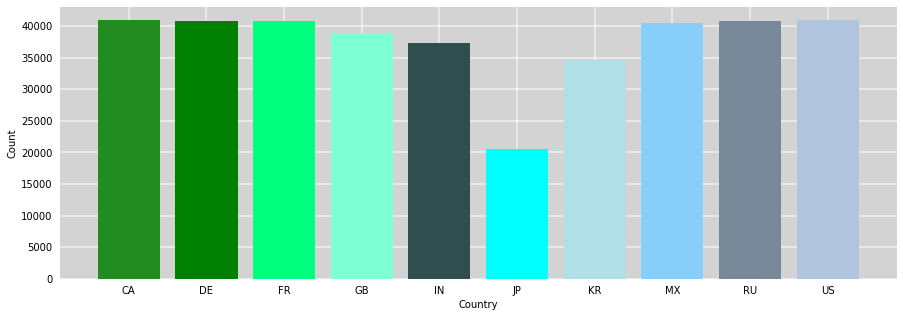
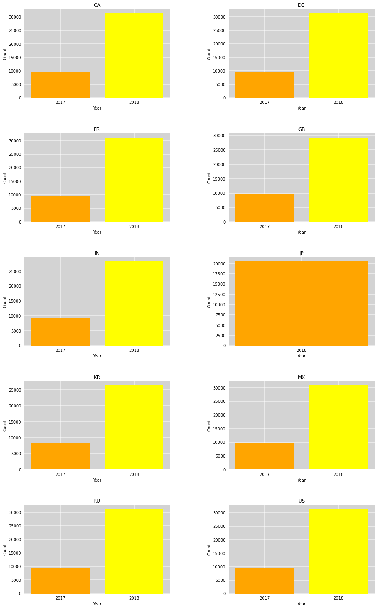
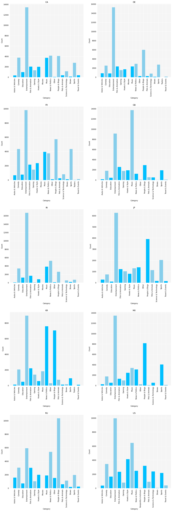
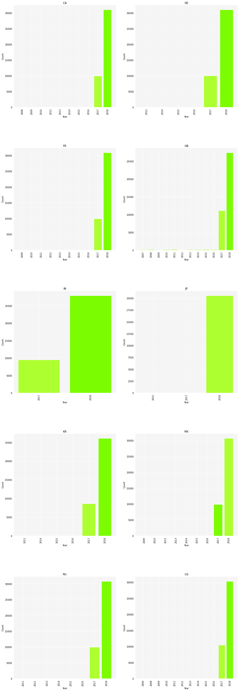
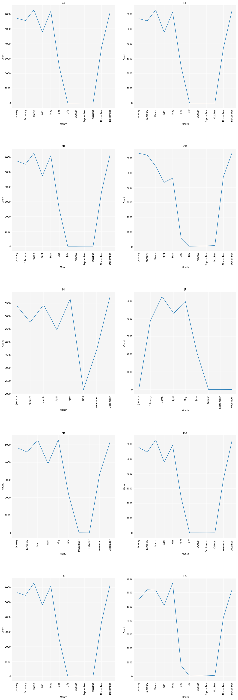
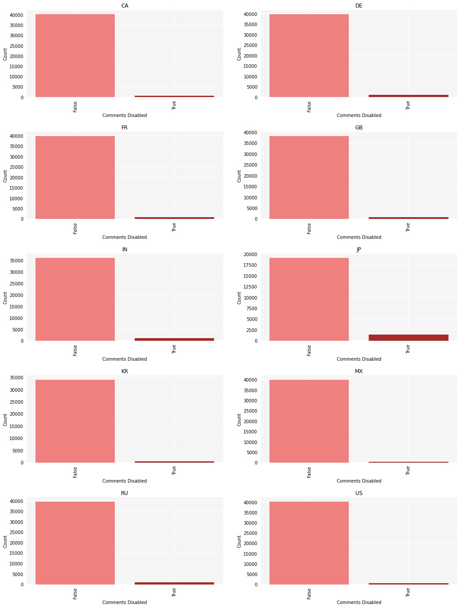
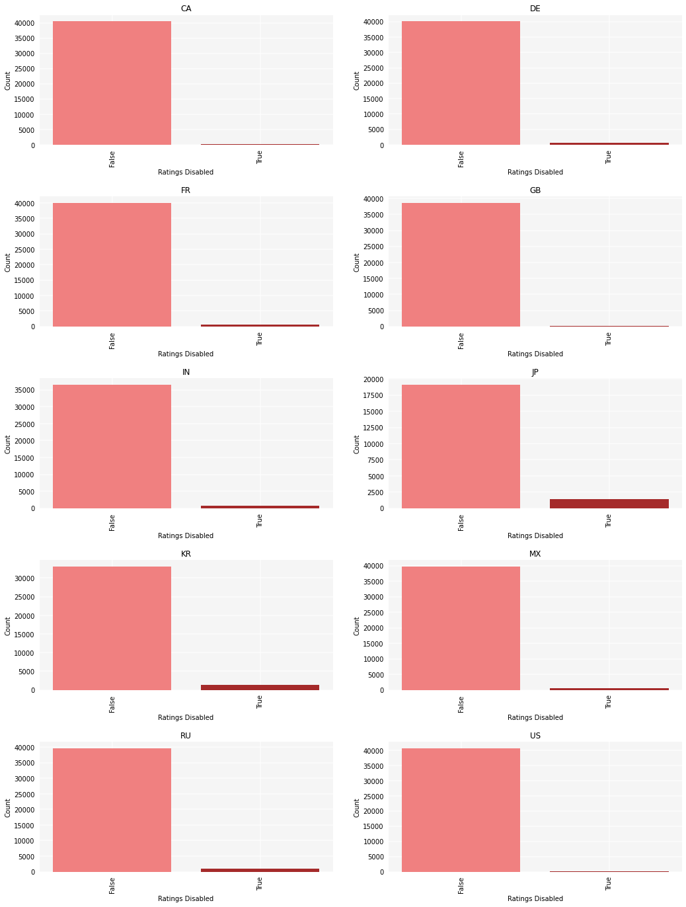
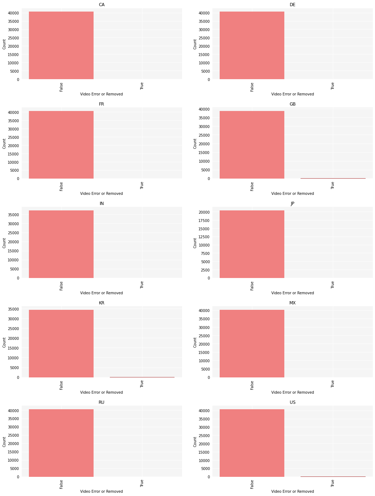
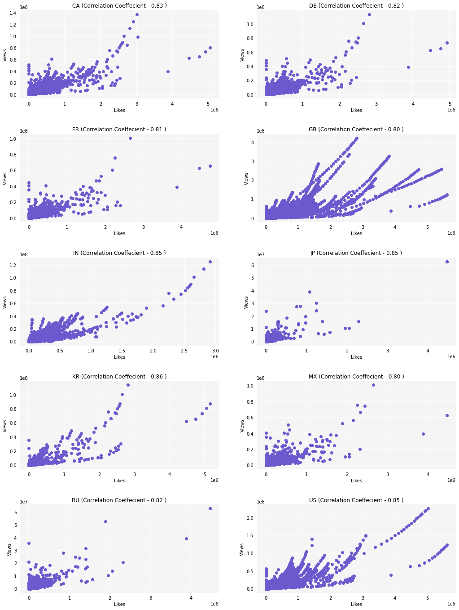
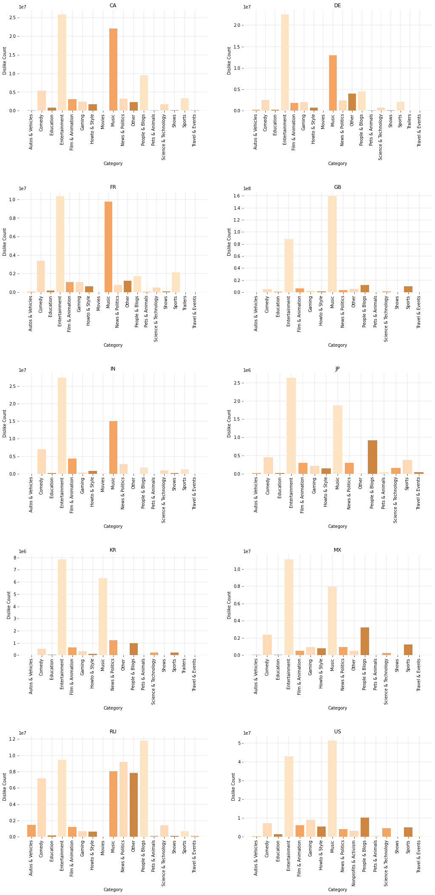

# Exploratory Data Analysis

## Country Wise Distibution

Inference : Except Japan(JP) all other countries are having a majority position in the number of trending videos

## Trending Date

Inference : All the countries are having majority of the trending videos in the year of 2018 while Japan has only trending videos in the year 2018.

## Number of days to become trending

Inference: Non Profit & Activism category have least days to come on trending whereas music has highest days to come on trending.

## Category

Inference : Overall, Trending video categories are dominated by Entertainment and People & Blogs followed by Music and News & Politics.

## Video Publish Time

Inference : In general, Trending videos are majorly published in the year 2017 and 2018 with negligibly less in the previous year except for India (IN) and Japan (JP) where the trending videos are published only in the years 2017 & 2018 and 2018 respectively

## Months

Inference : In General, the mid part of an year (July - October) seems to experience less trending videos in contrast to the beginning and end of an year.

## Comments Disabled 

## Ratings Disabled

## Video Error or Removed

Inference : The parameters of the trending videos states that majority of the videos did not have Comments Disabled, Ratings Disabled or Video removed.
## Likes vs Views

Inference : From the above visualizations and Correlation Coeffecient values, it is evident that all geographical locations follow a strong relation between Likes vs Views i.e, As the number of views of the video increases, the likes that the video gets also increases.

## Dislikes for Trending Videos

Inference : Entertainment and Music are the two categories which highest number of dislikes followed by Comedy and People & Blogs. Russia (RU) has dislikes in categories of News & Politics and Other too.